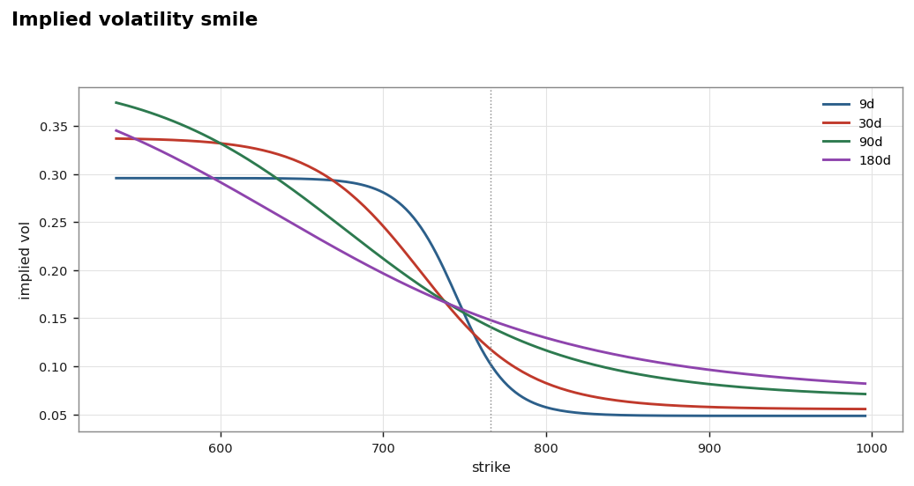
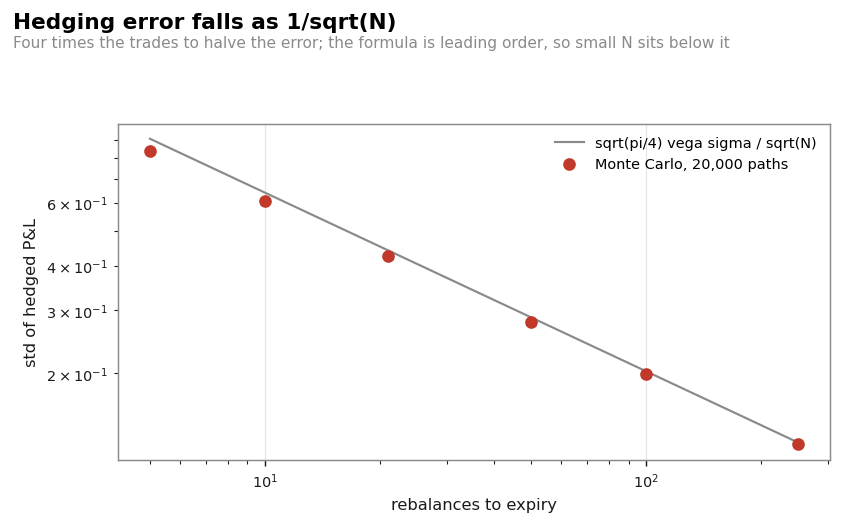
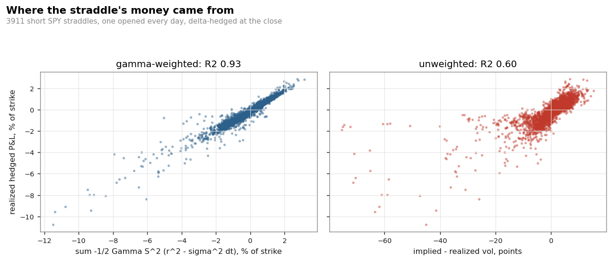
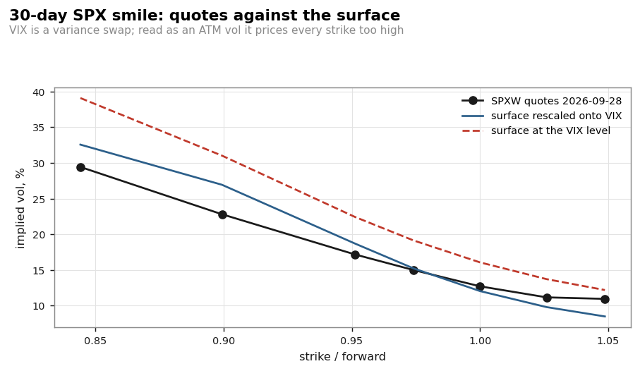
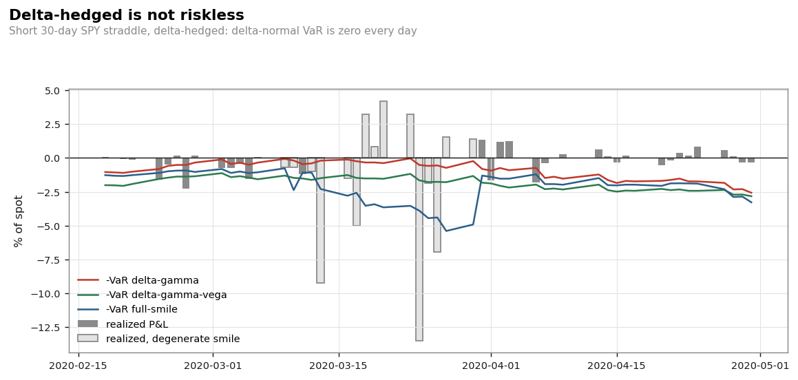

# Options Hedging & Risk

Delta hedging of SPY options, a daily volatility surface rebuilt from CBOE
indices, and a VaR backtest of the hedged position. Python, 2011-2026 data.



## Summary

- **Delta hedging.** Short an ATM SPY straddle every day from 2011, hedge the
  delta at the close, hold ~30 days (3,911 trades). The P&L is explained by
  gamma vs theta, i.e. realized vs implied volatility: R² = 0.93 against the
  gamma-theta sum, 0.60 against implied minus realized vol.
- **Volatility surface.** Approximated every day from four CBOE indices (VIX9D, VIX,
  VIX3M for the term structure, SKEW for the slope, VVIX for the curvature),
  with a no-arbitrage constraint on the smile.
- **VIX vs option vol.** VIX is a variance swap rate, so with a negative skew
  it sits above the at-the-money vol (ATM 11.3% vs VIX 14.2% and 12.7% vs
  16.1% on two real SPX chains). Selling the straddle at the VIX level shows
  +67 bp per trade; at the rescaled ATM level it is -14 bp after costs, which
  is not significant (181 independent trades) and depends on the rescaling.
- **VaR of the hedged book.** Five methods, backtested over 3,433 days.
  Delta-normal VaR is zero by construction for a delta-hedged book (baseline
  only). Delta-gamma-vega and both full revaluation methods pass the Kupiec
  test; which one looks best depends on how the realised P&L is repriced.

## Run

```bash
pip install -r requirements.txt
python scripts/run_hedge.py      # delta hedging: simulations, then SPY
python scripts/run_var.py        # VaR of the hedged book, five methods
python scripts/run_chain.py      # surface vs a real SPX option chain
python -m pytest tests/ -q       # 146 tests
```

Other scripts: `run_parity.py` (put-call parity checks), `run_lab.py` (payoff
and greeks of 17 option structures), `run_compare.py` (backtest of those
structures 2011-2026).

## 1. Delta hedging

A delta-hedged short option earns, each step,

```
dP&L = -1/2 Gamma S^2 ((dS/S)^2 - sigma^2 dt)
```

Theta collects implied variance, gamma pays realized variance. Before using
real data I checked three known results by Monte Carlo:

| Test | Result |
|---|---|
| Hedging error vs number of rebalances (Derman-Kamal) | within 1-8% of the formula, gap shrinks as N grows |
| Hedge at implied vs realized vol (sold at 20%, realized 25%) | same mean loss (-0.57), std 0.27 vs 0.13 |
| Leland volatility with 10 bp transaction costs | covers the rebalancing cost, mean P&L close to the opening trade cost |



Then on SPY, short one ATM straddle per day, 0.5 vol point half-spread and
1 bp per stock trade:

| | |
|---|---|
| Trades | 3,911 (overlapping), 181 non-overlapping |
| Mean P&L | -14 bp of strike, win rate 52.5% |
| Same trades sold at the VIX level | +67 bp, win rate 80.8% |
| Average implied vs realized vol | 14.7% vs 14.7% |
| R² of P&L on gamma-theta sum | 0.93 |
| R² of P&L on implied - realized vol | 0.60 |
| Worst trade | sold 9 Mar 2020 at 44% vol, realized 89%: -10.8% |



Realized vol alone explains less than the gamma-theta sum because a move costs
more when spot is near the strike close to expiry, where gamma is highest.

## 2. Volatility surface from CBOE indices

Historical option chains are not free, but CBOE publishes daily indices that
describe the surface:

| Index | Used for |
|---|---|
| VIX9D, VIX, VIX3M | ATM term structure, interpolated in total variance |
| SKEW | slope of the smile (matched to the risk-neutral skewness) |
| VVIX | curvature |

- Calibrated on 3,934 days (2011-2026). The SKEW target is matched exactly on
  56% of days; on the others the no-arbitrage constraint binds and the
  shortfall is recorded.
- VIX is the fair strike of a 30-day variance swap, not the ATM vol. With a
  negative skew it sits above the ATM vol, so the surface is rescaled so that
  its own variance swap equals VIX (median factor 0.78, about 3 vol points).
- Checked against real SPX chains downloaded from CBOE (`data/chains/`).



## 3. VaR of the hedged position

Book: short one 30-day ATM straddle, delta hedged, rebuilt every day.
One-day 99% VaR from a 500-day window, backtested 2013-2026 (3,433 days).

| Method | Mean VaR | Exceptions | Kupiec p |
|---|---|---|---|
| Delta-normal | 0 bp | 43.55% | 0.000 |
| Delta-gamma-theta | 124 bp | 3.12% | 0.000 |
| Delta-gamma-theta-vega | 194 bp | 0.76% | 0.135 |
| Full revaluation, parallel vol shift | 178 bp | 0.84% | 0.348 |
| Full revaluation on the smile | 158 bp | 1.14% | 0.433 |

On the full sample, delta-gamma-vega and both full revaluation methods pass
the Kupiec test. The ranking between them is not robust: the realised P&L is
itself repriced on the reconstructed smile, which favours the smile method.
Repricing it with a parallel vol shift instead, full revaluation on the smile
fails (2.18% exceptions). Delta-normal is zero by construction, since the book
has no delta. All methods fail the Christoffersen independence test: the
exceptions cluster (10 of 39 in Feb-Apr 2020). The largest "realised" losses
(March 2020) fall on days where the smile fit is degenerate, so they are model
errors as much as market moves.



## Limitations

- SPY is treated as European with no dividend yield (q = 0) on unadjusted
  closes, so ex-dividend drops count as price moves.
- Only the ATM level and the index-implied smile are real data. Individual
  strike quotes and bid-ask are modelled, except on the two SPX chains.
- The smile shape is the weakest part: on the chains checked, OTM puts come
  out up to 4 vol points too expensive and OTM calls up to 3 points too cheap.
- The VaR uses a 500-day window, which reacts slowly after a calm period.

## Structure

```
opt/
  bs.py           Black-Scholes, greeks, implied vol
  surface.py      CBOE indices -> arbitrage-free smile
  hedge.py        discrete delta hedging, Derman-Kamal, Leland, SPY replay
  var.py          VaR of the hedged book, Kupiec and Christoffersen tests
  chain.py        CBOE delayed SPX chain (fetch and cache)
  parity.py       put-call parity, implied rate, box spread
  legs.py         multi-leg positions
  strategies.py   17 option structures
  sim.py          strike selection, rolling, costs
  attribution.py  daily P&L by greek
  vol.py          realized vol, GARCH/HAR forecasts
  risk.py         position limits
  data.py         CBOE and Yahoo loaders with cache
  charts.py       figures
  ib.py           Interactive Brokers connection (paper account only)
scripts/          one script per part
tests/            146 tests
```

Data: CBOE index history and SPX chains, SPY prices from Yahoo Finance.
